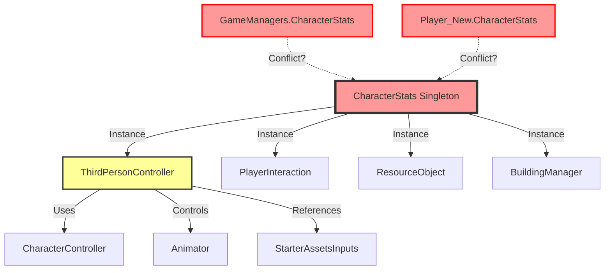

# Project Architecture Specification

**Project**: Personal_Project_Valheim  
**Generated**: 2026-02-12  
**Purpose**: Comprehensive documentation of project structure, dependencies, and architectural issues

---

## 🚨 CRITICAL WARNINGS

### Duplicate Component Detected

> [!CAUTION]
> **CharacterStats** exists on **TWO** GameObjects simultaneously:
> 1. `GameManagers` (Instance ID: 84994)
> 2. `Player_New` (Instance ID: 879258)
>
> **Impact**: This creates a **singleton conflict**. CharacterStats implements a singleton pattern (`CharacterStats.Instance`), which means only ONE instance should exist. Having two instances causes:
> - Data race conditions (which instance is "Instance"?)
> - Inconsistent stamina/health values
> - Potential null reference errors
> - **May contribute to physics calculation errors** (vertical velocity, movement speed)
>
> **Resolution Required**: Remove CharacterStats from `GameManagers`, keep only on `Player_New`

---

## 1. Object Hierarchy (Scene Structure)

### Root GameObjects (14 total)

```
SampleScene/
├─ Main Camera (ID: 581454)
│  └─ Components: Camera, AudioListener, PlayerInteraction, CinemachineBrain
│
├─ Directional Light (ID: 446874)
│  └─ Components: Light, UniversalAdditionalLightData
│
├─ Valheim Global Volume (ID: 887022)
│  └─ Components: Volume (Post-Processing)
│
├─ Stats Canvas (ID: 693198) [UI]
│  ├─ HealthBar (child)
│  └─ StaminaBar (child)
│
├─ GameManagers (ID: 84990) ⚠️ DUPLICATE ISSUE
│  └─ Components: CharacterStats*, InventoryManager, PlayerSpawner
│
├─ Inventory Canvas (ID: 431412) [UI]
│  ├─ InventoryUI component
│  └─ Children: Inventory panels
│
├─ Spawn_Point (ID: 231678)
│  └─ Children: Spawn markers (4 children)
│
├─ Player_New (ID: 879244) ⭐ MAIN PLAYER
│  ├─ Components: CharacterController, ThirdPersonController, CharacterStats*, Animator
│  └─ Children: 11 (weapon sockets, camera targets, etc.)
│
├─ Environment (ID: 1073940) [TERRAIN]
│  ├─ Layer: 9 (Terrain)
│  ├─ Components: Terrain, TerrainCollider, TerrainGenerator, VegetationSpawner
│  └─ Children: 92,102 (trees, rocks, vegetation)
│
├─ CM FreeLook1 (ID: 1101686) [CAMERA]
│  ├─ Components: CinemachineFreeLook, CinemachineCollider, CameraZoom
│  └─ Children: 3 (camera rigs: Top, Middle, Bottom)
│
├─ Terrain_(0.00, 0.00, -512.00) (ID: 590026) [TERRAIN CHUNK]
│  ├─ Layer: 9 (Terrain)
│  └─ Components: Terrain, TerrainCollider
│
├─ BuildingManager_System (ID: 375714)
│  └─ Components: BuildingManager
│
└─ DEBUG_TEST_TREE (×2 instances)
   └─ Components: LODGroup, ResourceNode, MeshCollider
```

---

## 2. Component Map (Detailed)

### Player_New (ID: 879244) - **CRITICAL OBJECT**

| Component | Instance ID | Purpose |
|-----------|-------------|---------|
| `Transform` | 879248 | Position (56, 6.2, 56.78) |
| `CharacterController` | 879246 | Physics movement (isGrounded: **false**) |
| `PlayerInput` | 879256 | New Input System integration |
| `StarterAssetsInputs` | 879254 | Input data storage |
| **`ThirdPersonController`** | 879252 | **Main movement logic** |
| `Animator` | 879250 | Character animations |
| `CameraInputBridge` | 879262 | Camera input handling |
| `PlayerEquipmentManager` | 879260 | Weapon management |
| **`CharacterStats`** ⚠️ | 879258 | **Health/Stamina (DUPLICATE!)** |
| `PlayerHarvestingIK` | 879264 | Inverse kinematics for harvesting |

**Key Settings**:
- `GroundedOffset`: `-0.2`
- `GroundedRadius`: `0.4`
- `GroundLayers`: `769` (layers 0, 8, 9)
- `Gravity`: `-15.0`
- `JumpHeight`: `1.2`

### GameManagers (ID: 84990) - **SINGLETON CONTAINER**

| Component | Instance ID | Purpose |
|-----------|-------------|---------|
| `Transform` | 84996 | Position (0, 0, 0) |
| **`CharacterStats`** ⚠️ | 84994 | **Health/Stamina (DUPLICATE!)** |
| `InventoryManager` | 84992 | Global inventory system |
| `PlayerSpawner` | 84998 | Spawns player at start |

### Main Camera (ID: 581454)

| Component | Purpose |
|-----------|---------|
| `Camera` | Main rendering camera |
| `AudioListener` | Audio receiver |
| `PlayerInteraction` | Raycast-based interaction system |
| `CinemachineBrain` | Virtual camera controller |
| `CinemachineInputProvider` | Input for camera control |

### Environment (ID: 1073940)

| Component | Purpose |
|-----------|---------|
| `Terrain` | Procedural terrain renderer |
| `TerrainCollider` | Terrain physics collider |
| `TerrainGenerator` | Runtime terrain generation |
| `VegetationSpawner` | Tree/rock placement |

---

## 3. Script Dependencies (Data Flow)

### CharacterStats.Instance References

**Scripts accessing `CharacterStats.Instance` (Singleton)**:

1. **`ThirdPersonController.cs`** (8 references) ⚠️ **CRITICAL**
   - Line 224: Check if Instance exists
   - Line 226: `CanSprint()` check
   - Line 229: Set `isSprinting` flag
   - Line 231-233: Sprint stamina drain
   - Line 428: Attack stamina check
   - Line 438-439: Attack stamina consumption
   - **Impact**: If Instance points to wrong CharacterStats, movement/stamina fails

2. **`PlayerInteraction.cs`** (1 reference)
   - Line 36: Stamina check for interactions

3. **`ResourceObject.cs`** (4 references)
   - Lines 18, 20, 25: Stamina checks/usage for harvesting

4. **`BuildingManager.cs`** (3 references)
   - Lines 294, 296, 301: Stamina checks/usage for building

### Dependency Graph



**Analysis**: 
- 15 total references to `CharacterStats.Instance`
- If GameManagers.CharacterStats initializes first, Player_New.CharacterStats is ignored
- If Player_New.CharacterStats initializes first, it may be overwritten
- **Result**: Unpredictable behavior, null references, or stale data

---

## 4. Physics Layer Setup

### Layer Assignment Table

| Layer # | Layer Name | Assigned Objects | Physics Interactions |
|---------|-----------|------------------|---------------------|
| 0 | Default | Most objects, old terrain | Collides with all |
| 8 | *(undefined)* | Legacy references | Included in GroundLayers mask |
| 9 | **Terrain** | Environment, Terrain chunks | Ground detection |
| - | Player | Player_New (tag, not layer) | - |
| - | Building | Building objects | Shelter detection |

### Current GroundLayers Configuration

**Player_New.ThirdPersonController.GroundLayers**:
- **Value**: `769` (binary: `1100000001`)
- **Layers Included**: 0 (Default), 8 (undefined), 9 (Terrain)
- **Purpose**: Defines what ThirdPersonController considers "ground"

### Layer Issues

> [!WARNING]
> Layer 8 is referenced in GroundLayers mask but has no defined name. This may be a legacy setting. Consider:
> - Removing layer 8 from mask (set to `513` = layers 0 + 9)
> - OR defining layer 8 as "Ground" if needed

---

## 5. Critical System Interactions

### Player Movement Flow

```
User Input (WASD/Gamepad)
    ↓
StarterAssetsInputs (stores input)
    ↓
ThirdPersonController.Move()
    ├→ Checks CharacterStats.Instance.CanSprint()
    ├→ Checks Grounded (via GroundedCheck())
    │   └→ Physics.CheckSphere(GroundLayers mask)
    │       └→ Detects terrain on layers 0, 8, 9
    ├→ Applies gravity (JumpAndGravity())
    │   ├→ Velocity clamping (-50 to +50)
    │   └→ Emergency landing if Y > 100
    └→ CharacterController.Move()
```

### Grounding Detection Chain

```
ThirdPersonController.GroundedCheck()
    ↓
Physics.CheckSphere(
    position: player.position + Vector3.down * 0.2,
    radius: 0.4,
    layerMask: 769
)
    ↓
Returns: true if sphere overlaps terrain collider
    ↓
Grounded = true → Resets _verticalVelocity to -2f
```

---

## 6. Proposed Architecture Fixes

### Immediate Actions Required

1. **Remove Duplicate CharacterStats** (HIGH PRIORITY)
   ```
   Action: Delete CharacterStats component from GameManagers (ID: 84994)
   Reason: Player_New.CharacterStats should be the singleton Instance
   Risk: GameManagers may reference health/stamina bars
   Solution: Update healthBar/staminaBar references to point to Player_New's CharacterStats
   ```

2. **Verify Singleton Initialization Order**
   ```
   Action: Check CharacterStats.Awake() to ensure it properly handles existing Instance
   Expected: Player_New's CharacterStats should become the Instance
   ```

3. **Clean Up Layer 8**
   ```
   Action: Remove layer 8 from GroundLayers mask
   New Value: 513 (layers 0 + 9 only)
   Reason: Layer 8 is undefined and unnecessary
   ```

### Long-Term Improvements

1. **Decouple ThirdPersonController from CharacterStats**
   - Consider passing stamina as a parameter instead of singleton access
   - Improves testability and reduces coupling

2. **Centralize Manager References**
   - Create a GameManager singleton that holds references to all managers
   - Avoid multiple singletons competing for initialization

3. **Layer Strategy**
   - Define clear layer strategy document
   - Assign semantic meaning to each layer (Player, Enemy, Terrain, Items, etc.)

---

## 7. Debugging Checklist

### When Physics Issues Occur:

- [ ] Check console for `CharacterStats.Instance` null warnings
- [ ] Verify which CharacterStats is the active Instance (use breakpoint)
- [ ] Monitor `isGrounded` value in Inspector during play
- [ ] Check GroundLayers mask value (should be 769 or 513)
- [ ] Use Scene Gizmos to visualize grounding sphere
- [ ] Check for emergency landing warnings in console

### When Stamina Issues Occur:

- [ ] Verify CharacterStats.Instance is not null
- [ ] Check which GameObject owns the active CharacterStats
- [ ] Verify health/stamina bar references point to active CharacterStats
- [ ] Check for stamina drain rate (sprint/attack costs)

---

## Summary

**Project Health**: ⚠️ **CRITICAL ISSUES PRESENT**

**Main Issues**:
1. 🔴 **Duplicate CharacterStats** - causes singleton conflict
2. 🟡 **Layer 8 undefined** - in GroundLayers but has no name
3. 🟡 **High coupling** - 15 singleton references across 5 scripts

**Recommended Next Steps**:
1. Remove CharacterStats from GameManagers
2. Test that Player_New.CharacterStats becomes the singleton
3. Update health/stamina bar references if broken
4. Consider architecture refactoring for better separation of concerns

---

*This document should be updated whenever major architectural changes occur.*
